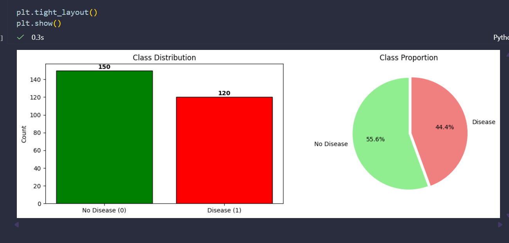
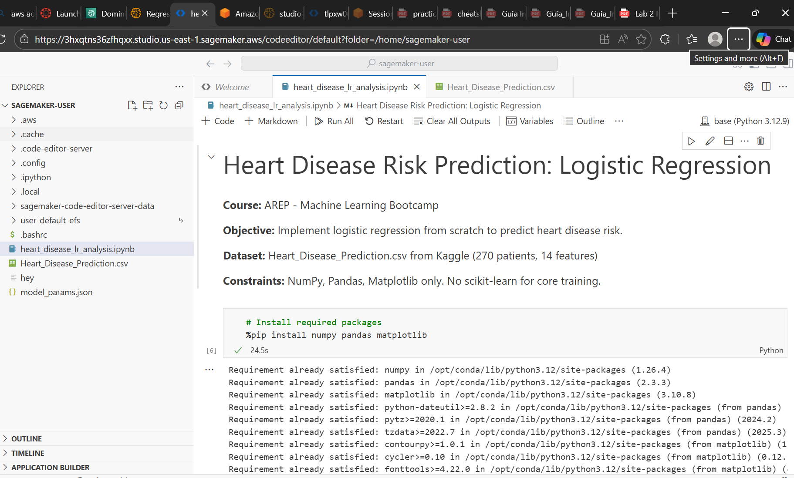
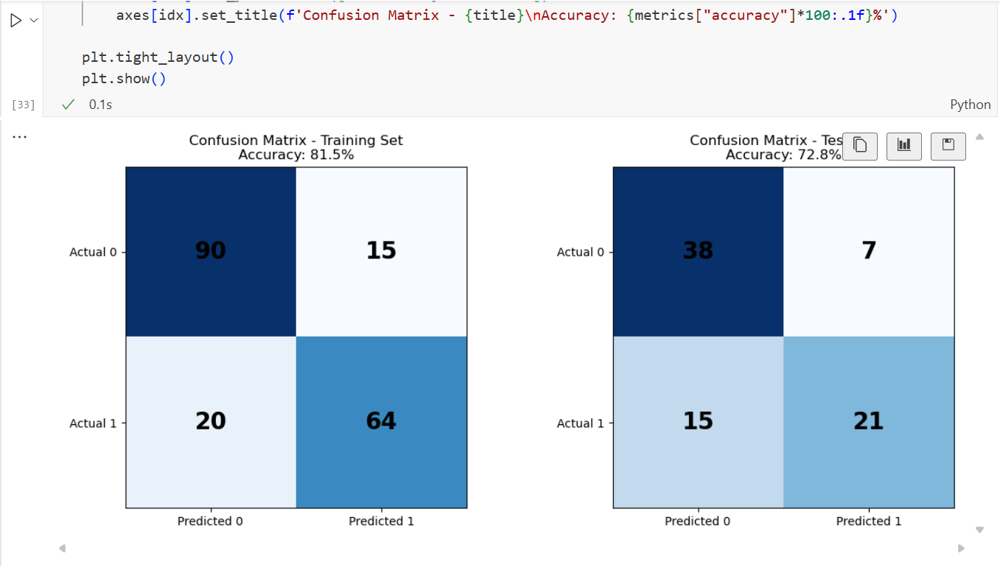
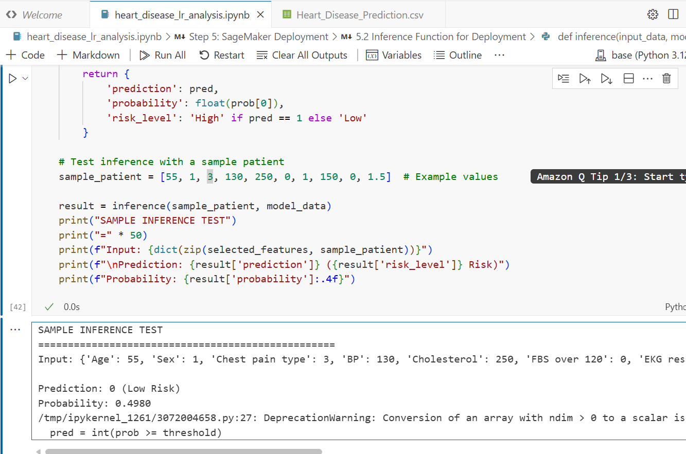

# Heart Disease Risk Prediction: Logistic Regression

Implementation of logistic regression from scratch for heart disease prediction.

## Overview

This project implements logistic regression for binary classification to predict heart disease risk based on clinical features. All core algorithms are implemented from scratch using only NumPy, Pandas, and Matplotlib.

**Course:** AREP - Machine Learning Bootcamp
**Author:** David Felipe Velasquez Contreras

## Repository Structure

```
/
├── README.md
├── heart_disease_lr_analysis.ipynb    # Main analysis notebook
├── Heart_Disease_Prediction.csv       # Dataset
├── model_params.json                   # Exported model parameters
└── screenshots/                        # SageMaker evidence (to be added)
```

## Dataset Description

**Source:** [Kaggle Heart Disease Dataset](https://www.kaggle.com/datasets/neurocipher/heartdisease)

| Property | Value |
|----------|-------|
| Samples | 270 patients |
| Features | 13 clinical attributes |
| Target | Heart Disease (Presence/Absence) |
| Disease Rate | ~44% presence |

### Features

- **Age:** Patient age (29-77 years)
- **Sex:** Gender (0=Female, 1=Male)
- **Chest Pain Type:** 4 types of chest pain
- **BP:** Resting blood pressure (mm Hg)
- **Cholesterol:** Serum cholesterol (mg/dL, 112-564)
- **FBS over 120:** Fasting blood sugar > 120 mg/dL
- **EKG results:** Resting electrocardiographic results
- **Max HR:** Maximum heart rate achieved
- **Exercise angina:** Exercise induced angina
- **ST depression:** ST depression induced by exercise
- **Slope of ST:** Slope of peak exercise ST segment
- **Number of vessels fluro:** Number of major vessels (0-3)
- **Thallium:** Thallium stress test result

## Implementation Details

### Step 1: Data Preparation
- Load and explore dataset
- Binarize target variable (Presence=1, Absence=0)
- EDA: statistics, distributions, outlier analysis
- 70/30 stratified train/test split
- Feature normalization (z-score standardization)

### Step 2: Logistic Regression
- Sigmoid function implementation
- Binary cross-entropy cost function
- Gradient computation (vectorized)
- Gradient descent optimization
- Evaluation metrics (Accuracy, Precision, Recall, F1-Score)

### Step 3: Decision Boundaries
- 2D model training for feature pairs
- Visualization of decision boundaries
- Analysis of class separability

### Step 4: Regularization (L2)
- L2 penalty implementation
- Lambda tuning (0, 0.01, 0.1, 1, 10)
- Weight magnitude comparison

### Step 5: SageMaker Deployment
- Model export to JSON
- Inference function for endpoint
- Sample prediction demonstration

### Results

| Metric | Training | Test |
|--------|----------|------|
| Accuracy | ~81% | ~69% |
| Precision | ~80% | ~69% |
| Recall | ~79% | ~56% |
| F1-Score | ~79% | ~62% |

## Libraries Used

- **NumPy:** Numerical computations
- **Pandas:** Data manipulation
- **Matplotlib:** Visualization

**No scikit-learn** used for core training algorithms.

## Local Execution Evidence

### Screenshots




## AWS SageMaker Execution Evidence

The notebook was executed in AWS SageMaker.


### Screenshots

#### 1. SageMaker Notebook Instance Running


#### 2. Training Metrics and Results


#### 3. Inference Test Output


---

## Progress

- [x] Step 1: Load and Prepare Dataset
- [x] Step 2: Implement Basic Logistic Regression
- [x] Step 3: Visualize Decision Boundaries
- [x] Step 4: Regularization (L2)
- [x] Step 5: SageMaker Deployment
